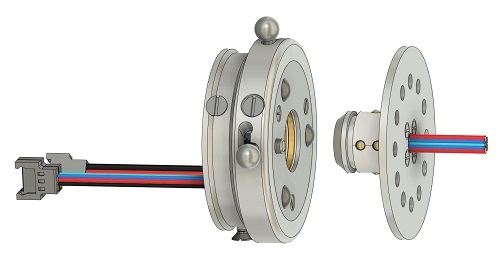

# Electric prosthetic wrist

**🚧 WORK IN PROGRESS 🚧** 

*We are currently working on updating this repository.*

Branch branch_pogo_pin: **Discontinued design** of the Elecwrist, using pogo-pins to make electrical contact. This solution has been successfully tested but abandonned due to its complexity and the higher BOM cost compared with the new solution.

This repository contents documentation of ELECWRIST product: it is a prosthetic wrist which allows electrical connexion of a myoelectric hand. It is based on the [universal wrist](https://github.com/orthopus/01-wrist) design, sharing the same functions and specifications, except it adds the electrical connexion feature.

The Elecwrist is compatible with any standard ORTHOPUS mechanical tool. WARNING: when using a mechanical tool with Elecwrist, please turn off power supply and remove the battery.

## WARNING NOTICE BEFORE STARTING

The versions of our solutions reproduced in Do It Yourself do not have the CE marking. It can only be applied to solutions developed and sold by ORTHOPUS which follow the regulations in force.
ORTHOPUS cannot guarantee the “quality” of solutions replicated by third parties thanks to documentation shared on github.

## CONTRIBUTION

Your contribution to this project is welcome!

* Have you discovered a bug or you have an improvement ideas ?
  
  * Go to the GitHub [issues](https://github.com/orthopus/01-elecwrist/issues) of the project.
  
* You have time, some Maker skills and you want to help us ?

  * Read the [CONTRIBUTING](CONTRIBUTING.md) file to help us to upgrade this project

  * Read the [CODEOFCONDUCT](CODEOFCONDUCT.md) file to know community standards

## CONTACT

If you wish to contact us, you can send a message to contact@orthopus.com
